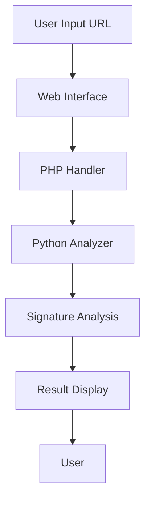

# Malicious Script Detection Web Service

[](LICENSE)
[](https://www.python.org/)
[](https://developer.mozilla.org/en-US/docs/Web/JavaScript)
[](https://www.php.net/)

## Overview
This project implements a web service that detects malicious scripts in suspicious URLs. It analyzes the signature patterns of scripts and provides detailed information about potential security threats.

### System Architecture


## Features
- URL restoration and signature analysis
- Script extraction and deobfuscation
- Real-time malicious script detection
- Web-based user interface
- Detailed analysis report generation
- Support for various script types
- Secure execution environment

## Project Structure
```
MaliciousScriptDetector/
├── Python/              # Python analysis scripts
│   ├── Detect.py       # Main detection logic
│   └── utils/          # Utility functions
├── WEB/                # Web interface
│   ├── testphp.html    # Input interface
│   ├── testphp.php     # PHP handler
│   └── Result.html     # Results display
└── README.md          # This file
```

## Usage

### Prerequisites
- Ubuntu (VMware virtual environment)
- Apache Tomcat
- Python 3.x
- PHP 7.x
- MySQL
- Modern web browser

### Installation
1. Set up the virtual environment:
```bash
# Install required packages
sudo apt-get update
sudo apt-get install apache2 php mysql-server python3
```

2. Configure the web server:
```bash
# Copy web files to Apache directory
sudo cp -r WEB/* /var/www/html/
```

3. Set up Python environment:
```bash
# Install Python dependencies
pip install -r requirements.txt
```

### Running the Service
1. Start the web server:
```bash
sudo service apache2 start
```

2. Access the web interface:
```
http://localhost/testphp.html
```

### Usage Example
1. Enter a suspicious URL in the input field
2. Click "Analyze" button
3. View the analysis results:
   - Script extraction
   - Deobfuscation results
   - Signature analysis
   - Threat level assessment

## Implementation Details

### URL Analysis Process
1. URL Restoration
   - Decode URL encoding
   - Restore original parameters
   - Validate URL format

2. Script Extraction
   - Parse HTML/JavaScript content
   - Extract embedded scripts
   - Identify script patterns

3. Deobfuscation
   - Decode common obfuscation techniques
   - Restore original script content
   - Handle multiple encoding layers

4. Signature Analysis
   - Compare against known malicious patterns
   - Analyze script behavior
   - Generate threat assessment

### Security Features
- Sandboxed execution environment
- Input validation and sanitization
- Secure communication protocols
- Access control mechanisms

## Performance Considerations
- Efficient script parsing
- Optimized signature matching
- Caching of analysis results
- Resource usage optimization

## Dependencies
- Python 3.x
- PHP 7.x
- MySQL
- Apache Tomcat
- Modern web browser

## Build Requirements
- Ubuntu 18.04 or higher
- Apache 2.4 or higher
- Python 3.6 or higher
- PHP 7.2 or higher
- MySQL 5.7 or higher

## Testing
```bash
# Run Python tests
python3 -m unittest discover Python/tests

# Test web interface
curl http://localhost/testphp.html
```

## Contributing
1. Fork the repository
2. Create your feature branch (`git checkout -b feature/AmazingFeature`)
3. Commit your changes (`git commit -m 'Add some AmazingFeature'`)
4. Push to the branch (`git push origin feature/AmazingFeature`)
5. Open a Pull Request

## License
This project is proprietary and confidential.

## Author
Choi Hong Suk

## Acknowledgments
- OWASP security guidelines
- Python security best practices
- Web security standards
